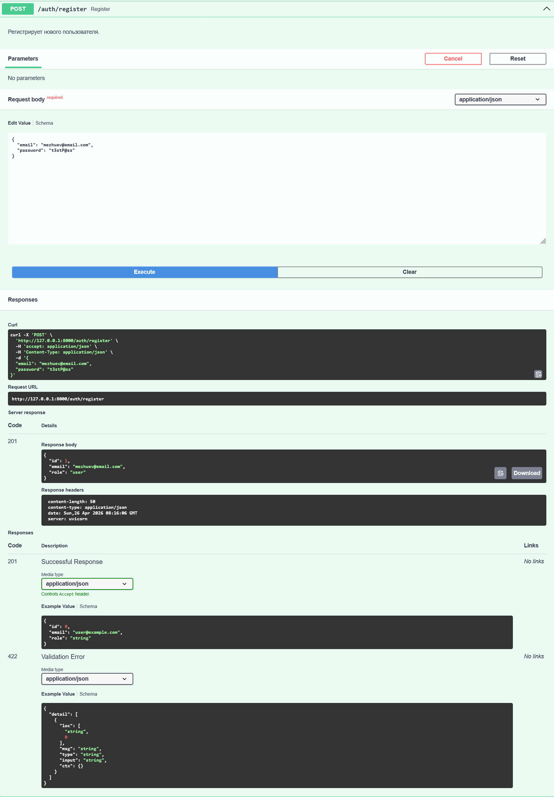
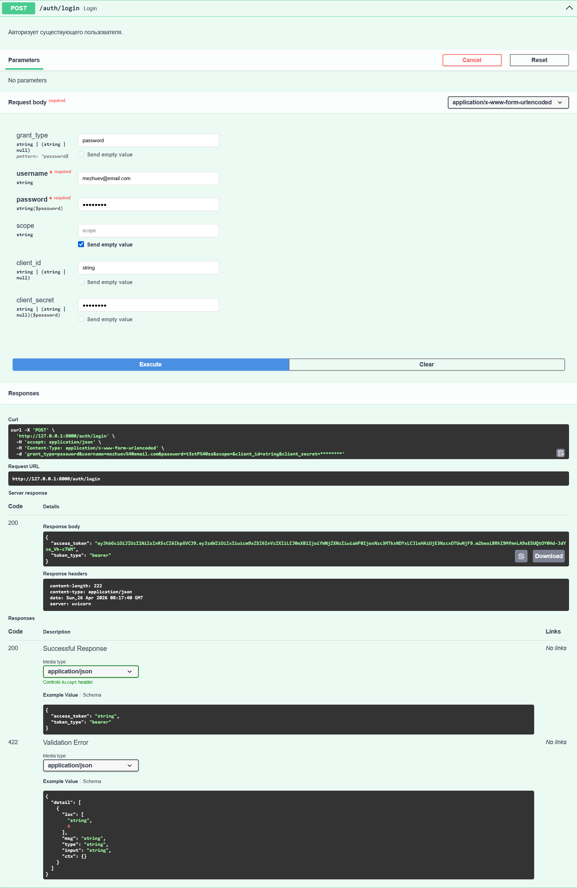
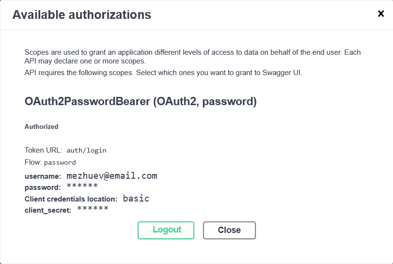
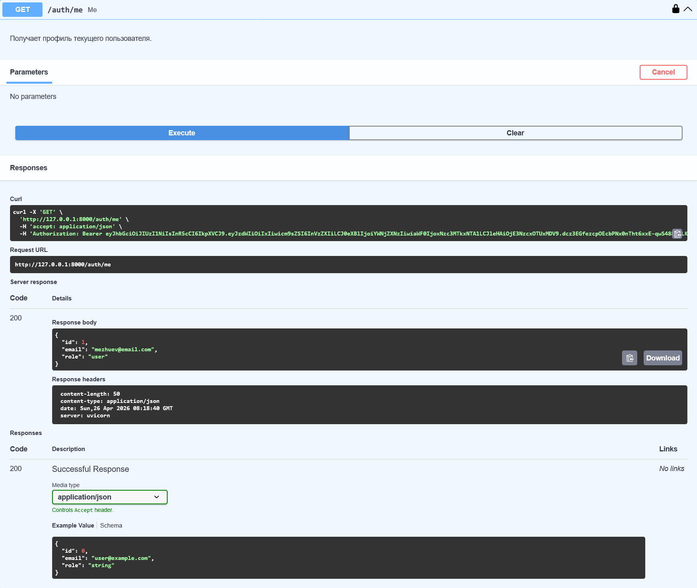
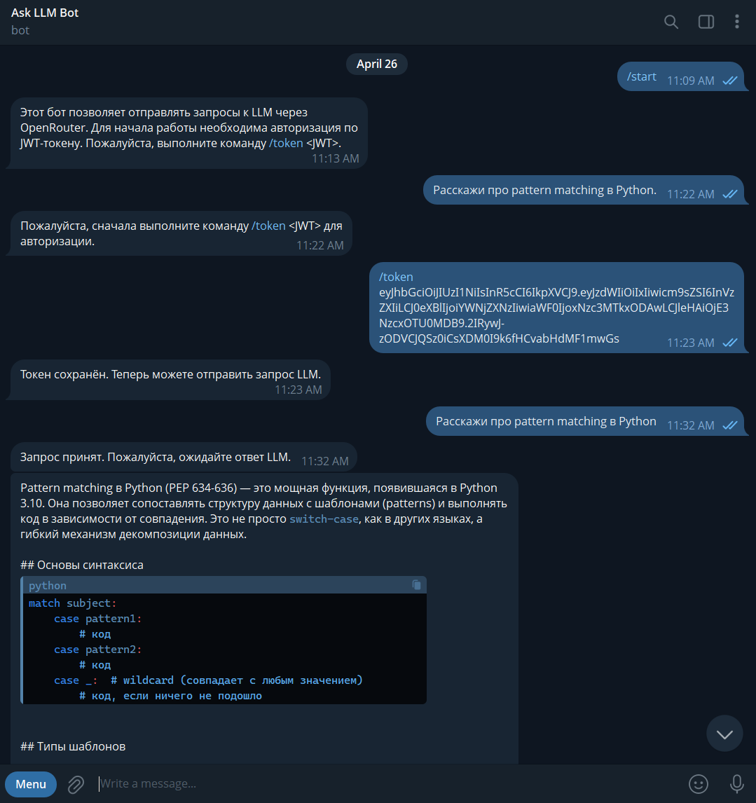
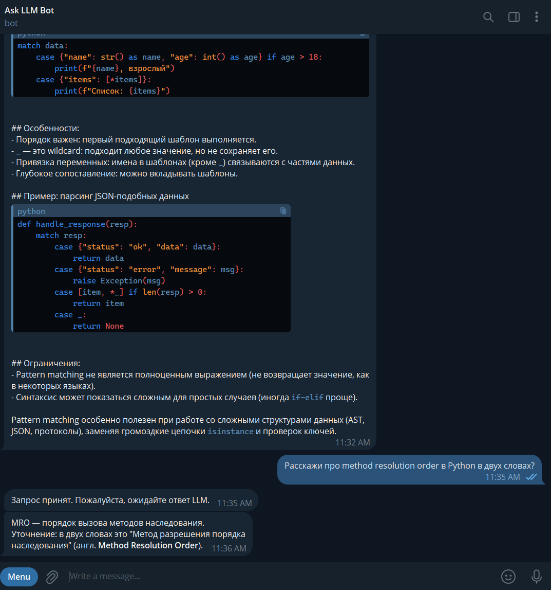
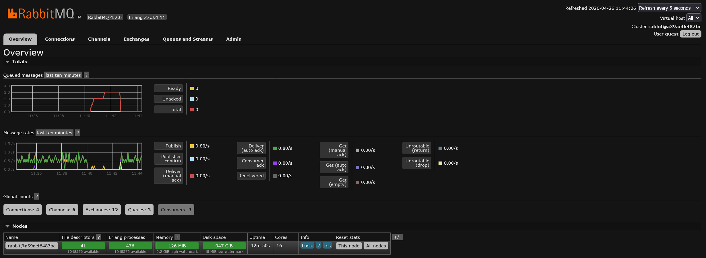
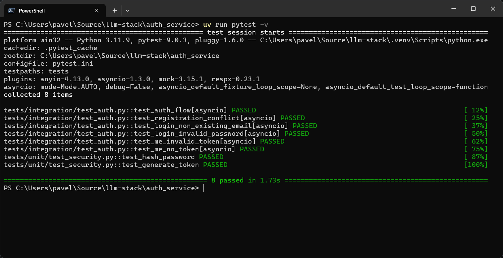
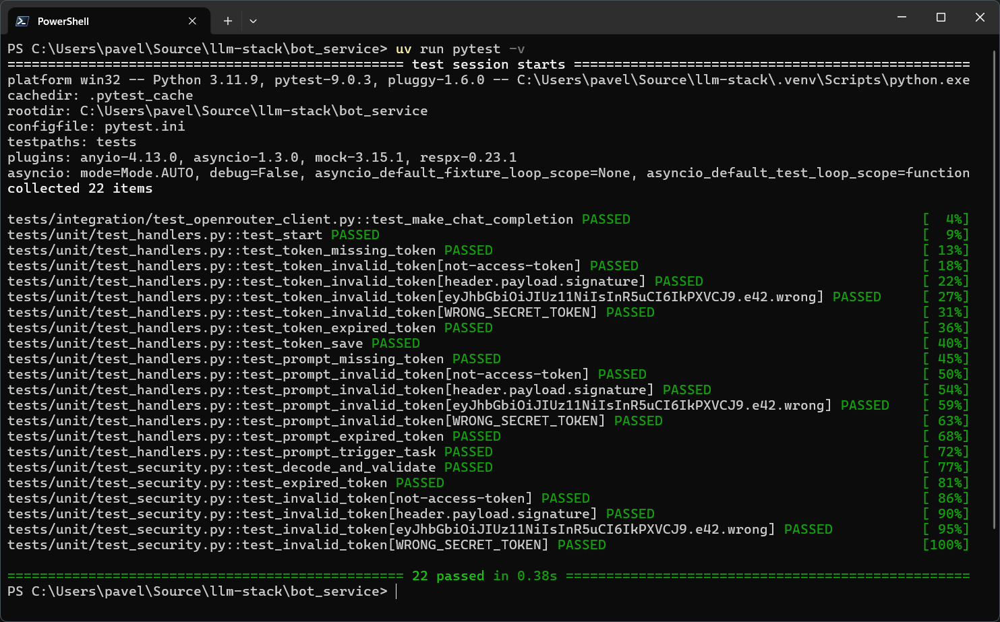

# llm-stack

Двухсервисная система взаимодействия с большой языковой моделью (LLM) с помощью Telegram-бота.

## Архитектура

Система состоит из двух сервисов:

- `auth_service` - сервис авторизации
- `bot_service` - Telegram-бот

Сервис авторизации - это приложение FastAPI, которое занимается регистрацией новых пользователей и выдачей JWT токенов доступа, которые будут использоваться для авторизации действий при общении с ботом. Приложение автономное, то есть не требует никаких других сервисов для работы.

Telegram-бот состоит из нескольких частей:

- приложение FastAPI, которое получает сообщения от пользователей бота
- приложение Celery для выполнения HTTP-запросов к OpenRouter.ai в фоновом режиме

Для работы Telegram-бота также применяются:

- RabbitMQ в качестве очереди сообщений
- Redis для хранения токенов доступа, результатов выполнения фоновых задач и уведомления о готовности результатов

## Сценарий работы с системой

1. В приложении Telegram пользователь начинает работу с ботом, выполнив команду `/start`.
2. Бот отправляет пользователю инструкцию по авторизации.
3. Пользователь регистрируется в системе с помощью запроса к сервису авторизации и получает токен доступа.
4. Пользователь выполняет команду `/token <JWT>`, указав полученный токен доступа.
5. Бот проверяет токен и подтверждает наличие доступа.
6. Пользователь отправляет запрос к LLM в чат бота.
7. Бот подтверждает получение запроса.
8. Пользователь получает ответ от LLM по готовности.

Пользователь может отправлять запросы, пока у токена доступа не закончится срок действия. Затем он может запросить новый токен и повторить действия для авторизации.

## Техническое описание работы системы

Приложение Telegram-бота подключается к Telegram API в режиме polling для получения сообщений пользователей и их обработку. Это сделано с помощью библиотеки `aiogram`. Обработчики реагируют только на личные сообщения, а именно:

- команду `/start` - печатает приветственное сообщений
- команду `/token <JWT>` - бот проверяет и сохраняет токен доступа в Redis вместе с идентификатором пользователя, или отправляет сообщение, что токен невалидный.
- любое другое сообщение - бот проверяет в Redis, есть ли для текущего пользователя валидный токен доступа. Если токен есть, то текст запроса пользователя и его идентификатор отправляются сообщением в RabbitMQ, а пользователю предлагают дождаться ответного сообщения.

Приложение Celery работает независимо от Telegram-бота. Оно подключается к RabbitMQ и, при получении нового сообщения с запросам пользователя, выделяет один рабочий процесс (worker) для отправки этого запроса к OpenRouter.ai. При получении ответа от LLM, он worker сохраняет его в Redis и отправляет уведомление приложению Telegram-бота через механизм Redis PubSub после того, как ответ был записан в хранилище. На этом работа Celery заканчивается.

Telegram-бот при старте подписывается на уведомления Redis PubSub, поэтому, когда приходит уведомление о получении ответа от LLM, бот получает результат из хранилища Redis и отправляет результат работы LLM пользователю обратным сообщением.

Таким образом, бот отвечает пользователю почти мгновенно, а затратные по времени операции (HTTP-запрос и ожидание ответа LLM) производятся в фоне с помощью Celery workers.

## Запуск

Для запуска системы потребуются [код приложения](https://github.com/subterraneanbob/llm-stack) и [Docker](https://www.docker.com/).

Запуск без Docker возможен, но это более трудозатратно, так как потребуется установить дополнительно:

- пакетный менеджер [`uv`](https://docs.astral.sh/uv/getting-started/installation/)
- [Redis](https://redis.io/downloads/)
- [RabbitMQ](https://www.rabbitmq.com/docs/download)

Перед запуском необходимо произвести настройку системы. В дальнейшем предполагается, что команды выполняются из директории с проектом.

### Настройка приложений перед запуском

Настройка сервисов осуществляется с помощью файлов `.env` и переменных окружения, причём переменные окружения имеют приоритет, если используются оба варианта одновременно. Названия переменных можно посмотреть в файле `.env.example`, соответствующем нужному сервису.

#### Сервис аутентификации

Переходим в директорию `auth_service` и делаем копию файла-примера `.env.example`:

```shell
cp .env.example .env
```

Для нормальной работы сервиса нужно заполнить как минимум `JWT_SECRET` - секретный ключ для генерации JWT токенов доступа. Для этого выполняем:

```shell
# На любой платформе, где установлен OpenSSL
openssl rand -base64 32
# PowerShell
$bytes = [byte[]]::new(32); [System.Security.Cryptography.RNGCryptoServiceProvider]::Create().GetBytes($bytes); [Convert]::ToBase64String($bytes)
```

Остальные настройки можно не изменять.

#### Сервис Telegram-бота и сервис фоновых задач

Аналогично, переходим в директорию `bot_service` и делаем копию файла-примера `.env.example`:

```shell
cp .env.example .env
```

Настройки, необходимые для работы:

- `TELEGRAM_BOT_TOKEN` - токен доступа к Telegram API, для получения нужно пообщаться в Telegram с `@BotFather` и создать нового бота.
- `JWT_SECRET` - секретный ключ для проверки токенов доступа. **НЕ** генерируем новый, а берём значение, которое было заполнено для `auth_service` ранее.
- `OPENROUTER_API_KEY` - ключ доступа к OpenRouter.ai. Для получения требуется зарегистрироваться на платформе [OpenRouter](https://openrouter.ai) и создать ключ доступа на странице [API keys](https://openrouter.ai/workspaces/default/keys).
- `OPENROUTER_MODEL` - заполняем нужную модель, например, `openrouter/free`, т.к. указанная по умолчанию модель `stepfun/step-3.5-flash:free` может быть недоступна.

Для запуска без `Docker` **обязательно** нужно проверить строки подключения `Redis` и `RabbitMQ`: ключи `REDIS_URL` и `RABBITMQ_URL` соответственно.

Остальные настройки можно менять по желанию (они описаны в файле `.env.example`).

### Запуск с помощью Docker

Из корневой директории проекта выполняем команду:

```shell
docker compose up --build
```

Эта команда собирает код сервисов в образы, загружает зависимости (Redis, RabbitMQ) и запускает их. После запуска всех контейнеров система готова к работе.

### Запуск вручную

Для любителей приключений систему можно запустить без `Docker`. Для этого устанавливаем зависимости с помощью пакетного менеджера (из корневой директории):

```shell
uv sync --all-packages
```

Далее, устанавливаем Redis и RabbitMQ, следуя инструкциям с официальных сайтов, проверяем, что они запущены, а затем выполняем следующие команды.

Из директории `auth_service` запускаем сервис аутентификации:

```shell
uv run uvicorn app.main:app --host "" --port 8000
```

Из директории `bot_service` запустим Telegram-бота:

```shell
uv run uvicorn app.main:app --host "" --port 8001
```

а также сервис фоновых задач:

```shell
uv run celery -A app.infra.celery_app.celery_app worker --loglevel=info
```

## Пользовательский сценарий работы

1. В Telegram находим бота по имени, которое было указано при его создании через `@BotFather`.
2. Выполняем команду `/start`.
3. В браузере открываем страницу с UI сервиса авторизации: http://0.0.0.0:8000/docs.
4. Регистрируемся через метод `/auth/register`.
5. Затем, используя те же e-mail и пароль, выполняем метод `/auth/login` и получаем токен доступа.
6. В Telegram выполняем команду `/token <токен>`, где указываем полученный токен.
7. После получения сообщения, что токен принят, пишем запросы к LLM и дожидаемся ответа.

## Демонстрация работы (скриншоты)

### Сервис аутентификации

<details>
  <summary>Регистрация пользователя</summary>



</details>

<details>
  <summary>Логин и получение JWT</summary>



</details>

<details>
  <summary>Авторизация через Swagger</summary>



</details>

<details>
  <summary>Профиль пользователя</summary>



</details>

### Чат с Telegram-ботом

<details>
  <summary>Старт и авторизация</summary>



</details>

<details>
  <summary>Ответы бота</summary>



</details>

### RabbitMQ

<details>
  <summary>Management UI</summary>



</details>

### Тестирование

<details>
  <summary>Auth Service</summary>



</details>

<details>
  <summary>Bot Service</summary>



</details>
